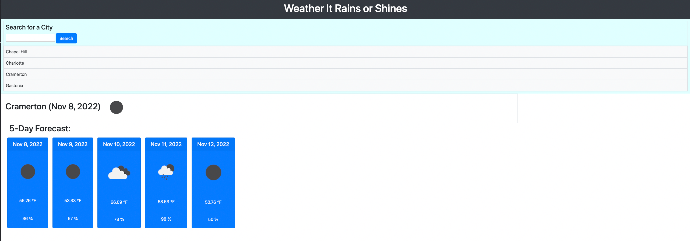

# Weather-It-Rains-or-Shines

## Objective

- Create a weather forecasting application using a weather api.
- Allow a forecast of the upcoming 5 days and also save previous searched cities.

## User Story

- AS A traveler
- I WANT to see the weather outlook for multiple cities
- SO THAT I can plan a trip accordingly

## Results

- I was able to successfully use a weather api to get the needed criteria completed while also forecasting up to the next 5 days and saving the previous searched cities.

## Screenshot of Deoplyed Application

## Deployed Link

-

### Created by Brian Koo
